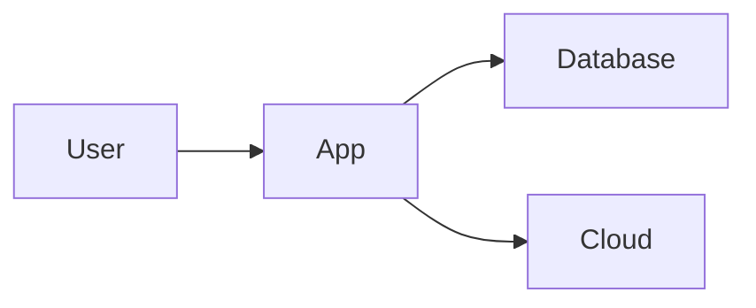

# Overview

**Goal:** Explain **what** this project is and **why** it exists.

---

## What is Your Project Name?

Write a simple explanation here. Imagine explaining it to a friend.

**Example:**
*"This project helps you organize your photos automatically using AI, so you don't have to sort them manually."*

**Key Points to Cover:**
- What problem does it solve?
- Who is it for? (Students, Businesses, Everyone?)
- Why is it better than the alternatives?

---

## Key Concepts

Explain important terms users might encounter.

### Concept 1: [Name]
*Simple explanation.*

### Concept 2: [Name]
*Simple explanation.*

---

## How it Works (Architecture)

Briefly explain how the system is built, but keep it simple.

1. **User** interacts with the App.
2. **App** saves data to the Database.
3. **App** syncs with Cloud for backup.

---

## Technology Stack

List the tools used to build this project.

| Category | Technology |
| :--- | :--- |
| **Frontend** | [e.g., React, Vue] |
| **Backend** | [e.g., Python, Node.js] |
| **Database** | [e.g., PostgreSQL] |

---

!!! tip "Keep it Simple"
    Avoid using too much jargon. If you must use a technical term, explain it first!
