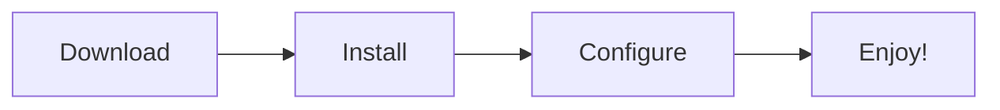

# Your Project Name

---

## Welcome

**Your Project Name** is the easiest way to [solve a problem]. We built this to help [target audience] achieve [goal] without the hassle.

> *Replace this text with a simple, jargon-free description of your project.*

---

## Features at a Glance

| Feature | What it does for you |
| :--- | :--- |
| **Feature 1** | Solves problem A instantly. |
| **Feature 2** | Makes task B easier and faster. |
| **Feature 3** | Keeps your data safe and secure. |
| **Feature 4** | Allows you to work from anywhere. |

---

## Quick Navigation

=== "New Users"

    1. **Install:** Follow the simple [Installation Guide](install/index.md).
    2. **Learn:** Read the [Usage Guide](usage/index.md) to get started.
    3. **Explore:** See all [Features](features/index.md).

=== "Administrators"

    1. **Check:** Verify [System Requirements](install/index.md#system-requirements).
    2. **Setup:** Configure via [Operations Guide](operations/index.md).

=== "Developers"

    1. **Code:** Get the source code in [Developer Installation](install/index.md#developer-installation).
    2. **Understand:** Read the [Overview](definition/index.md).

---

## Documentation Structure

-   **Release Notes**
    ---
    See what's new in the latest update.
    [Read Notes](release-notes/index.md)

-   **Overview**
    ---
    Learn what this project is all about.
    [Read Overview](definition/index.md)

-   **Features**
    ---
    Discover everything this tool can do.
    [See Features](features/index.md)

-   **Operations**
    ---
    Manage and configure the system.
    [Manage System](operations/index.md)

---

## Getting Started Flow

1. **Download** the app for your computer.
2. **Install** it following our simple guide.
3. **Configure** your basic settings.
4. **Start** using it!

---

!!! note "Current Version: 2.x"
    You are viewing the latest version. Check [Release Notes](release-notes/index.md) for changes.

---

## Need Help?

- **Read Docs:** Check the sidebar menu.
- **Report Bug:** Let us know on [GitHub Issues](https://github.com/your-username/your-project/issues).
- **Ask Question:** Chat in [GitHub Discussions](https://github.com/your-username/your-project/discussions).
