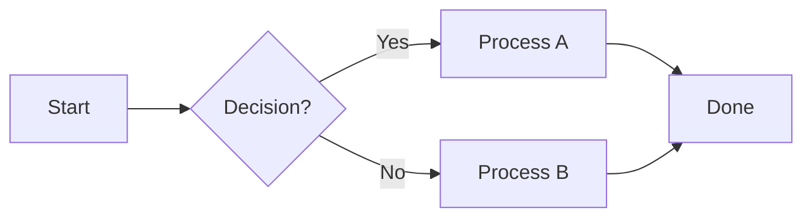
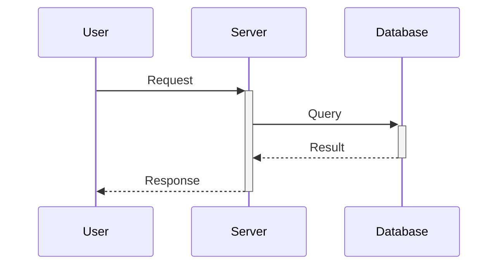

<p align="center">
  
</p>

<h1 align="center">MkDocs Documentation Template</h1>

<p align="center">
  <strong>A professional, ready-to-use documentation template powered by MkDocs Material</strong>
</p>

<p align="center">
  <a href="#about">About</a> •
  <a href="#features">Features</a> •
  <a href="#installation">Installation</a> •
  <a href="#how-to-add-navigation-menus">Menus</a> •
  <a href="#how-to-add-new-pages">Pages</a> •
  <a href="#how-to-add-admonitions-callout-boxes">Admonitions</a> •
  <a href="#customization">Customization</a> •
  <a href="#deployment">Deployment</a>
</p>

<p align="center">
  
  
  
</p>

---

## About

This is a **professional documentation template** built with [MkDocs Material](https://squidfunk.github.io/mkdocs-material/) by **Perseverance Technology Co., Ltd.**

We built this template so you can create **beautiful, well-organized documentation** without starting from scratch. Just clone it, change the content, and you're ready to go.

**Here's what it looks like:**

| Light Mode | Dark Mode |
|:---:|:---:|
|  |  |

---

## Features

| Feature | What It Does |
|---|---|
| **Modern Design** | Clean, professional UI with the Material theme |
| **Dark / Light Mode** | Users can toggle between dark and light themes |
| **Fully Responsive** | Looks great on desktop, tablet, and mobile |
| **Instant Search** | Built-in client-side search — fast and always available |
| **Code Highlighting** | Syntax highlighting for 100+ programming languages with copy button |
| **Mermaid Diagrams** | Create flowcharts, sequence diagrams, and more directly in Markdown |
| **Versioning** | Manage multiple documentation versions (v1.x, v2.x) using Mike |
| **Auto Deploy** | Push to `main` and it is automatically deployed via GitHub Actions |
| **Admonitions** | Callout boxes for notes, tips, warnings, and more |
| **Content Tabs** | Tabbed content for multi-platform guides (Windows / macOS / Linux) |

---

## Installation

### What You Need First

Make sure these are installed on your computer:

| Software | Minimum Version | Check Command |
|---|---|---|
| **Python** | 3.8 or higher | `python --version` |
| **pip** | (comes with Python) | `pip --version` |
| **Git** | Any recent version | `git --version` |

> **Tip:** If `python` does not work on your system, try `python3` instead.

### Step-by-Step Setup

**1. Clone (download) this project:**

```bash
git clone https://github.com/perseverance-tech-tw/Documentation-Template.git
cd Documentation-Template
```

**2. Create a virtual environment:**

A virtual environment keeps this project's packages separate from your system. This is recommended.

```bash
python -m venv .venv
```

**3. Activate the virtual environment:**

```bash
# Linux / macOS:
source .venv/bin/activate

# Windows (Command Prompt):
.venv\Scripts\activate

# Windows (PowerShell):
.venv\Scripts\Activate.ps1
```

> You will see `(.venv)` at the beginning of your terminal line when the virtual environment is active.

**4. Install the required packages:**

```bash
pip install -r requirements.txt
```

This installs three packages:
- `mkdocs-material` — the documentation framework and theme
- `mike` — version management for your docs
- `pymdown-extensions` — extra Markdown features (tabs, code highlighting, etc.)

**5. Start the local preview server:**

```bash
mkdocs serve
```

Then open your browser and go to: **http://localhost:8000**

> Any changes you save to your files will automatically refresh in the browser (live reload).

---

## Project Structure

Here's how the files are organized:

```
Documentation-Template/
│
├── .github/
│   └── workflows/
│       └── ci.yml                 # Auto-deploy script (GitHub Actions)
│
├── docs/                           # -- ALL YOUR CONTENT GOES HERE
│   ├── assets/
│   │   └── images/
│   │       └── ui/
│   │           └── logo.png        # Your project logo
│   ├── definition/
│   │   └── index.md                # Overview page
│   ├── features/
│   │   └── index.md                # Features page
│   ├── install/
│   │   └── index.md                # Installation guide page
│   ├── operations/
│   │   └── index.md                # Operations guide page
│   ├── release-notes/
│   │   └── index.md                # Release notes page
│   ├── usage/
│   │   ├── index.md                # Usage guide page
│   │   └── mkdocs-mike-guide.md    # MkDocs + Mike versioning guide
│   ├── javascripts/
│   │   └── scroll-animate.js       # Custom scroll animation
│   ├── stylesheets/
│   │   └── extra.css               # Custom CSS styles
│   ├── favicon.ico                 # Browser tab icon
│   └── index.md                    # -- HOME PAGE
│
├── overrides/
│   └── partials/
│       └── footer.html             # Custom footer template
│
├── mkdocs.yml                      # -- MAIN CONFIG FILE (everything is set here)
├── requirements.txt                # Python package list
└── readme.md                       # This file
```

### Key Files You Should Know

| File | What It Does |
|---|---|
| `mkdocs.yml` | **The control center.** Manages site name, navigation menus, theme, plugins, and more. |
| `docs/index.md` | **The home page** — the first thing visitors see. |
| `docs/` folder | Where all your Markdown content pages live. |
| `overrides/partials/footer.html` | Custom footer (logo + copyright + social links). |
| `.github/workflows/ci.yml` | Automatically deploys your docs when you push to `main`. |

---

## How to Add Navigation Menus

The navigation menu (sidebar) is controlled by the `nav` section in **`mkdocs.yml`**.

Here's what the current navigation looks like:

```yaml
# In mkdocs.yml
nav:
  - Home: index.md
  - Release Notes: release-notes/index.md
  - Installation Guide: install/index.md
  - Overview: definition/index.md
  - Features: features/index.md
  - Usage Guide:
    - usage/index.md
    - MkDocs + Mike Guide: usage/mkdocs-mike-guide.md
  - Operations: operations/index.md
```

And here's how it appears on the website:


> The sidebar on the left shows all the menu items defined in `nav`.

### Adding a New Top-Level Menu

To add a new menu item at the top level, simply add a new line:

**Example: Adding an "API Reference" menu**

```yaml
nav:
  - Home: index.md
  - Release Notes: release-notes/index.md
  - Installation Guide: install/index.md
  - Overview: definition/index.md
  - Features: features/index.md
  - Usage Guide:
    - usage/index.md
    - MkDocs + Mike Guide: usage/mkdocs-mike-guide.md
  - Operations: operations/index.md
  - API Reference: api/index.md          # <-- NEW MENU ADDED HERE
```

Then create the corresponding file:

```bash
mkdir -p docs/api
```

Create the file `docs/api/index.md` with your content:

```markdown
# API Reference

Documentation for the project API.

---

## Endpoints

| Method | Endpoint | Description |
|---|---|---|
| GET | `/api/users` | Get list of users |
| POST | `/api/users` | Create a new user |
```

### Adding Sub-Menus (Dropdown)

Sub-menus let you group multiple pages under one parent menu. Use indentation (2 spaces):

**Example: Adding sub-pages under "Usage Guide"**

```yaml
nav:
  - Usage Guide:
    - usage/index.md                               # Main page (shown when clicking the menu)
    - MkDocs + Mike Guide: usage/mkdocs-mike-guide.md
    - Backup Guide: usage/backup-guide.md           # <-- New sub-page
    - Migration Guide: usage/migration-guide.md     # <-- New sub-page
```

Then create the files:

```bash
touch docs/usage/backup-guide.md
touch docs/usage/migration-guide.md
```

### Changing Menu Order

Just rearrange the lines in `nav`. The order in the file = the order on the website:

```yaml
nav:
  - Home: index.md
  - Features: features/index.md            # <-- Now second
  - Installation Guide: install/index.md    # <-- Now third
  # ... and so on
```

> **Important:** All file paths in `nav` are **relative to the `docs/` folder**. For example, `install/index.md` refers to `docs/install/index.md`.

---

## How to Add New Pages

### Step 1: Create a Markdown File

All content pages are written in **Markdown** (`.md` files) inside the `docs/` folder.

**Basic page template:**

```markdown
# Page Title

A brief description of what this page covers.

---

## Section 1

Write your content here. You can use:

- **Bold text** with `**text**`
- *Italic text* with `*text*`
- `Inline code` with backticks
- [Links](https://example.com) with `[text](url)`

---

## Section 2

### Sub-Section

More content goes here.
```

**Example: Creating a "Troubleshooting" page**

1. Create the folder and file:
   ```bash
   mkdir -p docs/troubleshooting
   ```

2. Create `docs/troubleshooting/index.md` with content:
   ```markdown
   # Troubleshooting

   Common problems and how to fix them.

   ---

   ## Module Not Found Error

   **Cause:** Packages are not installed.

   **Fix:**
   ```bash
   pip install -r requirements.txt
   ```

   ---

   ## Port Already in Use

   **Cause:** Another app is using port 8000.

   **Fix:**
   ```bash
   mkdocs serve -a localhost:8001
   ```
   ```

### Step 2: Register the Page in Navigation

Add it to the `nav` section in `mkdocs.yml`:

```yaml
nav:
  - Home: index.md
  # ... other menus ...
  - Troubleshooting: troubleshooting/index.md    # <-- ADD HERE
```

> **Note:** If you skip this step, the page still exists and can be accessed by URL — it just will not appear in the sidebar.

### Adding Images to a Page

1. Put your image in `docs/assets/images/`
2. Reference it in your Markdown:

```markdown

```

---

## How to Add Admonitions (Callout Boxes)

**Admonitions** are colored callout boxes that highlight important information. This template already has them enabled.

Here's what they look like on the site:


> See the yellow "Current Version: 2.x" box at the bottom — that is an admonition.

### All Admonition Types

Here are all the types you can use:

#### Note (blue)
```markdown
!!! note "Important Note"
    This is extra information that might be useful.
```

#### Tip (green)
```markdown
!!! tip "Pro Tip"
    A helpful suggestion or best practice.
```

#### Warning (orange)
```markdown
!!! warning "Be Careful"
    Something that could cause problems if ignored.
```

#### Danger (red)
```markdown
!!! danger "Critical Warning"
    Can cause data loss or system damage.
```

#### Info (blue)
```markdown
!!! info "Did You Know?"
    General information to help understanding.
```

#### Success (green)
```markdown
!!! success "All Done!"
    Confirmation that something was completed successfully.
```

#### Question (light blue)
```markdown
!!! question "FAQ"
    A common question with an answer.
```

#### Example (purple)
```markdown
!!! example "Example"
    A practical example to illustrate a concept.
```

#### Quote (gray)
```markdown
!!! quote "Quote"
    A quote from a reliable source.
```

#### Bug (red/pink)
```markdown
!!! bug "Known Bug"
    A documented bug and its status.
```

### Collapsible Admonitions (Click to Open/Close)

Use `???` instead of `!!!` to make an admonition that users can collapse:

**Collapsed by default (click to open):**
```markdown
??? note "Click to expand"
    This content is hidden until the user clicks on it.
    Great for optional details.
```

**Open by default (click to close):**
```markdown
???+ note "Click to collapse"
    This content is visible by default.
    Users can click to hide it.
```

---

## Advanced Markdown Features

This template comes with many powerful Markdown extensions already enabled. Here's how to use them.

### 1. Content Tabs

Perfect for showing instructions for different platforms or options side by side.


> Notice the **New Users / Administrators / Developers** tabs — each displays different content depending on the selected role.

**How to write content tabs:**

```markdown
=== "Windows"
    Instructions for Windows users.
    ```bash
    choco install your-app
    ```

=== "macOS"
    Instructions for Mac users.
    ```bash
    brew install your-app
    ```

=== "Linux"
    Instructions for Linux users.
    ```bash
    sudo apt install your-app
    ```
```

> **Important:** Content inside a tab must be indented with **4 spaces**.

### 2. Code Blocks

**Basic code block:**

````markdown
```python
def hello():
    print("Hello, World!")
```
````

**With line numbers:**

````markdown
```python linenums="1"
def hello():
    print("Hello, World!")
    return True
```
````

**Highlight specific lines:**

````markdown
```python hl_lines="2 3"
def hello():
    print("Hello, World!")  # This line is highlighted
    return True             # This one too
```
````

**Inline code highlight:**

```markdown
Use `#!python print("hello")` to print to the console.
```

> All code blocks automatically have a **Copy button** in the top-right corner.

### 3. Mermaid Diagrams

You can create diagrams directly in your Markdown files — no external tools needed!

**Flowchart:**

````markdown

````

**Sequence Diagram:**

````markdown

````

### 4. Emoji

Use emoji in your documentation with `:emoji_name:` syntax:

```markdown
:material-check: Done
:material-close: Failed
:material-alert: Warning
:fontawesome-brands-github: GitHub
:fontawesome-brands-python: Python
```

Browse all available icons: [Material Design Icons](https://squidfunk.github.io/mkdocs-material/reference/icons-emojis/)

### 5. Tables

```markdown
| Column 1 | Column 2 | Column 3 |
| :--- | :---: | ---: |
| Left-aligned | Centered | Right-aligned |
| Data A | Data B | Data C |
```

> `:---` = left, `:---:` = center, `---:` = right

---

## Customization

All customization is done through `mkdocs.yml` and the `overrides/` folder.

### 1. Change Project Identity

Open `mkdocs.yml` and update these lines at the top:

```yaml
site_name: Your Project Name
site_url: https://your-username.github.io/your-project/
repo_url: https://github.com/your-username/your-project
repo_name: Your Project
copyright: "&copy; 2026 Your Company. All rights reserved."
```

| Setting | What It Changes |
|---|---|
| `site_name` | The name shown in the header and browser tab |
| `site_url` | The URL where your docs will be hosted |
| `repo_url` | Adds a link to your GitHub repo in the header |
| `repo_name` | The label for the GitHub link |
| `copyright` | Text shown in the footer |

### 2. Change Logo & Favicon

| Asset | File Location | Where It Appears |
|---|---|---|
| **Logo** | `docs/assets/images/ui/logo.png` | Header and footer |
| **Favicon** | `docs/favicon.ico` | Browser tab icon |

**To change the logo:**
1. Prepare your logo image (PNG recommended, at least 200×200px)
2. Replace `docs/assets/images/ui/logo.png` with your image
3. Replace `docs/favicon.ico` with your icon

> **Tip:** Use [favicon.io](https://favicon.io/) to generate a `.ico` file from your logo image.

### 3. Change Theme Colors

Edit the `theme.palette` section in `mkdocs.yml`:

```yaml
theme:
  palette:
    # Light Mode
    - scheme: default
      primary: blue         # Main color (header, links)
      accent: amber         # Accent color (buttons, hover)
      toggle:
        icon: material/brightness-7
        name: Switch to dark mode
    # Dark Mode
    - scheme: slate
      primary: blue
      accent: amber
      toggle:
        icon: material/brightness-4
        name: Switch to light mode
```

**Available colors for `primary`:**

| | | | | |
|---|---|---|---|---|
| `red` | `pink` | `purple` | `deep purple` | `indigo` |
| `blue` | `light blue` | `cyan` | `teal` | `green` |
| `light green` | `lime` | `yellow` | `amber` | `orange` |
| `deep orange` | `brown` | `grey` | `blue grey` | `black` |

### 4. Change Fonts

```yaml
theme:
  font:
    text: Space Grotesk    # Body text font
    code: JetBrains Mono   # Code font
```

Fonts are loaded from [Google Fonts](https://fonts.google.com/). You can use any font available there, such as:
- `Roboto`, `Inter`, `Poppins`, `Open Sans`, `Lato`, `Outfit`, `Nunito`, etc.

### 5. Customize the Footer

The custom footer is in `overrides/partials/footer.html`. It automatically displays:
- **Logo & site name** (pulled from `mkdocs.yml`)
- **Copyright text** (pulled from `mkdocs.yml`)
- **Social links** (if configured — see below)

You can edit this HTML file directly to change the footer layout.

### 6. Add Social Links

Uncomment and update the `social` section in `mkdocs.yml`:

```yaml
extra:
  social:
    - icon: fontawesome/brands/github
      link: https://github.com/your-username
    - icon: fontawesome/brands/twitter
      link: https://twitter.com/your-username
    - icon: fontawesome/brands/linkedin
      link: https://linkedin.com/in/your-username
    - icon: fontawesome/brands/instagram
      link: https://instagram.com/your-username
```

These will appear as icons in the footer.

### 7. Custom CSS

The custom stylesheet is at `docs/stylesheets/extra.css`. It controls:

| Section | What You Can Change |
|---|---|
| **Design System (`:root`)** | Global colors for light and dark mode |
| **Header & Navigation** | Header background, search bar styling, version dropdown |
| **Code Blocks** | Code box colors, border, copy button style |
| **Tables** | Table borders and background |
| **Admonitions** | Callout box colors and styling |
| **Footer** | Footer layout, logo size, colors |
| **Motion** | Scroll animations |

> **Quick color change:** Edit the CSS variables in `:root` (for light mode) and `[data-md-color-scheme="slate"]` (for dark mode) to change colors globally.

---

## Deployment

### Option 1: Simple Deploy to GitHub Pages

For a simple, one-version documentation site:

```bash
mkdocs gh-deploy --force
```

This builds your site and pushes it to the `gh-pages` branch.

### Option 2: Versioned Deploy with Mike

Use **Mike** to manage multiple versions (e.g., v1.0 and v2.0 side by side):

**First time setup:**

```bash
# Deploy version 1.0 and label it "latest"
mike deploy --push 1.0 latest

# Set "latest" as the default page visitors see
mike set-default --push latest
```

**Update existing version:**

```bash
# Re-deploy version 1.0 with updated content
mike deploy --push 1.0 latest
```

**Release a new version:**

```bash
# Deploy version 2.0 and move the "latest" label to it
mike deploy --push --update-aliases 2.0 latest
```

**Other useful commands:**

```bash
mike list                    # See all deployed versions
mike delete --push 1.0       # Remove a version
mike serve                   # Preview versions locally
```

> The `latest` alias ensures visitors always land on the newest version by default.

### Option 3: Automatic Deploy (GitHub Actions)

This template includes a GitHub Actions workflow (`.github/workflows/ci.yml`) that **automatically deploys your documentation every time you push to the `main` branch**.

**Current setup** (simple deploy):

```yaml
- name: Deploy Documentation
  run: mkdocs gh-deploy --force
```

**To switch to versioned deploy:**

1. Open `.github/workflows/ci.yml`
2. **Comment out** the "Simple deployment" section
3. **Uncomment** the "Deploy with Versioning" section
4. Update the version variables as needed:

```yaml
- name: Deploy with Versioning
  env:
    DOCS_VERSION_ID: "1.0"
    DOCS_VERSION_TITLE: "Version 1.0"
    DOCS_VERSION_ALIAS: latest
  run: |
    mike deploy --push --update-aliases -t "$DOCS_VERSION_TITLE" "$DOCS_VERSION_ID" "$DOCS_VERSION_ALIAS"
    mike set-default --push latest
```

**GitHub Pages setup:**

1. Go to your repo on **GitHub** → **Settings** → **Pages**
2. Under **Source**, select the `gh-pages` branch
3. Click **Save**
4. Your site will be live at: `https://your-username.github.io/your-project/`

---

## Development Commands

A quick reference for all the commands you'll use:

| Command | What It Does |
|---|---|
| `mkdocs serve` | Start a local preview server (with live reload) |
| `mkdocs serve -a localhost:8001` | Preview on a different port |
| `mkdocs build` | Build the site into static HTML (into `site/` folder) |
| `mkdocs gh-deploy` | Deploy directly to GitHub Pages |
| `mike serve` | Preview with the version selector dropdown |
| `mike deploy --push <version> latest` | Deploy a specific version |
| `mike list` | List all deployed versions |
| `mike delete --push <version>` | Remove a specific version |
| `mike set-default --push latest` | Set the default version |

---

## FAQ

**Q: How do I add a new page?**
> 1. Create a `.md` file inside the `docs/` folder
> 2. Register it in the `nav` section of `mkdocs.yml`
> 3. Run `mkdocs serve` to preview

**Q: My changes don't show in the browser?**
> Make sure `mkdocs serve` is running. If still not showing, try a hard refresh: `Ctrl + Shift + R`.

**Q: How do I add images?**
> 1. Put the image in `docs/assets/images/`
> 2. Reference it in Markdown:
> ```markdown
> 
> ```

**Q: Can I have a page without it showing in the sidebar?**
> Yes! Just create the `.md` file without adding it to `nav`. It will be accessible by URL but not visible in the sidebar menu.

**Q: I get a "404 Not Found" after deploying with Mike?**
> Run: `mike set-default --push latest`

**Q: The version dropdown doesn't show up?**
> Make sure your `mkdocs.yml` has:
> ```yaml
> extra:
>   version:
>     provider: mike
> ```

**Q: How do I change the language?**
> In `mkdocs.yml`:
> ```yaml
> theme:
>   language: en    # Options: en, id, zh, ja, ko, de, fr, etc.
> ```

**Q: How do I add a new plugin?**
> 1. Install it: `pip install mkdocs-your-plugin`
> 2. Add it to `requirements.txt`
> 3. Add it to `mkdocs.yml`:
> ```yaml
> plugins:
>   - search
>   - your-plugin
> ```

---

## Contributing

We welcome contributions! Here's how:

1. **Fork** this repository
2. **Create** a feature branch: `git checkout -b feature/amazing-feature`
3. **Commit** your changes: `git commit -m 'Add amazing feature'`
4. **Push** to the branch: `git push origin feature/amazing-feature`
5. **Open** a Pull Request

---

## License

This project is licensed under the **MIT License** — see the [LICENSE](LICENSE) file for details.

---

## About Perseverance Technology

<p align="center">
  
</p>

<p align="center">
  <strong>Perseverance Technology Co., Ltd.</strong><br>
  Building innovative solutions for tomorrow
</p>

<p align="center">
  <a href="https://github.com/perseverance-tech-tw">
    
  </a>
</p>

---

<p align="center">
  Made by <strong>Perseverance Technology Co., Ltd.</strong>
</p>

<p align="center">
  Copyright 2026 Perseverance Technology Co., Ltd. All rights reserved.
</p>
